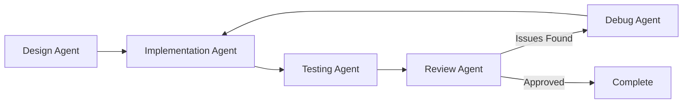

# Share Deck Manager - Development Agents

MVP開発を効率化するための専門agent群です。各agentは特定の役割に特化しており、完全な開発ワークフローをサポートします。

## 📋 Agent一覧

### 1. 🏗️ Design Agent (`design-agent`)
**役割**: システム設計・アーキテクチャ設計

**責務**:
- 要件分析と技術仕様書作成
- データベーススキーマ設計
- API設計（エンドポイント、リクエスト/レスポンス）
- コンポーネントアーキテクチャ設計
- セキュリティ・パフォーマンス考慮

**使用例**:
```bash
./run-agent.sh design "Add deck filtering and search functionality"
```

---

### 2. 💻 Implementation Agent (`implementation-agent`)
**役割**: フロントエンド・バックエンド実装

**責務**:
- 設計に基づいた機能実装
- Next.js/React コンポーネント作成
- FastAPI エンドポイント実装
- データベース操作（SQLModel）
- 入力検証（Zod/Pydantic）
- セキュアなコーディング

**使用例**:
```bash
./run-agent.sh implementation "Implement deck search API and UI"
```

---

### 3. 🧪 Testing Agent (`testing-agent`)
**役割**: テスト作成・品質保証

**責務**:
- ユニットテスト作成
- 統合テスト作成
- E2Eテスト設計
- テストカバレッジ向上（目標80%以上）
- エッジケース・エラーケーステスト

**使用例**:
```bash
./run-agent.sh testing "Test deck filtering functionality"
```

---

### 4. 🔍 Review Agent (`review-agent`)
**役割**: コードレビュー・品質チェック

**責務**:
- コード品質レビュー
- セキュリティ脆弱性チェック
- コーディング規約準拠確認
- パフォーマンスレビュー
- テストカバレッジ確認

**使用例**:
```bash
./run-agent.sh review "Review deck search implementation"
```

---

### 5. 🐛 Debug Agent (`debug-agent`)
**役割**: デバッグ・トラブルシューティング

**責務**:
- エラーログ解析
- バグの根本原因特定
- パフォーマンス問題調査
- Railway/Vercel デプロイ問題解決
- 認証・認可問題のデバッグ

**使用例**:
```bash
./run-agent.sh debug "Fix 500 error on deck creation endpoint"
```

---

## 🔄 完全開発ワークフロー

すべてのagentを順番に実行して、設計→実装→テスト→レビューのサイクルを完了します。

```bash
./run-agent.sh workflow "Add user profile page with nickname editing"
```

**実行順序**:
1. Design Agent - 技術仕様を作成
2. Implementation Agent - 機能を実装
3. Testing Agent - テストを作成・実行
4. Review Agent - コード品質をレビュー

問題が見つかった場合は、Debug Agentを手動で実行します。

---

## 🚀 使い方

### 基本的な使用方法

```bash
# 単一のagentを実行
./run-agent.sh <agent-name> "<task description>"

# 完全ワークフローを実行
./run-agent.sh workflow "<feature description>"
```

### 実践例

#### 例1: 新機能の追加（フルワークフロー）
```bash
./run-agent.sh workflow "Add deck export to JSON functionality"
```

#### 例2: 段階的な開発
```bash
# 1. まず設計
./run-agent.sh design "Add pagination to deck list"

# 2. 実装
./run-agent.sh implementation "Implement pagination for deck list API and UI"

# 3. テスト
./run-agent.sh testing "Test deck list pagination"

# 4. レビュー
./run-agent.sh review "Review pagination implementation"
```

#### 例3: バグ修正
```bash
# デバッグagentでエラーを調査
./run-agent.sh debug "Railway backend returns 500 on /api/v1/decks"

# 修正を実装
./run-agent.sh implementation "Fix deck creation validation error"

# テスト
./run-agent.sh testing "Test deck creation with edge cases"
```

---

## 📁 ディレクトリ構造

```
.claude/agents/
├── README.md                      # このファイル
├── design-agent.yaml              # 設計agent設定
├── implementation-agent.yaml      # 実装agent設定
├── testing-agent.yaml             # テストagent設定
├── review-agent.yaml              # レビューagent設定
├── debug-agent.yaml               # デバッグagent設定
├── orchestrator.py                # Agentオーケストレーター
└── run-agent.sh                   # 実行スクリプト
```

---

## ⚙️ Agent設定のカスタマイズ

各agent設定ファイル（`*-agent.yaml`）を編集することで、agentの動作をカスタマイズできます。

```yaml
name: design-agent
description: System architecture and design specialist
model: sonnet  # sonnet | opus | haiku
tools:
  - Read
  - Write
  - Edit
  - Glob
  - Grep
system_prompt: |
  # Agentに与える指示をここに記述
```

---

## 🔧 トラブルシューティング

### Agent実行時のエラー

**問題**: `Agent not found`
```bash
# 解決: 正しいagent名を使用
./run-agent.sh design "..."  # ✅
./run-agent.sh designer "..."  # ❌
```

**問題**: Python依存関係エラー
```bash
# 解決: PyYAMLをインストール
pip install pyyaml
```

---

## 📊 ワークフロー例

### 典型的な機能開発フロー



### 使用例: デッキフィルタリング機能の追加

```bash
# ステップ1: 設計
./run-agent.sh design "Add filtering by deck name and owner"
# → Output: API設計、DB変更案、UI設計

# ステップ2: 実装
./run-agent.sh implementation "Implement deck filtering"
# → Output: FastAPIエンドポイント、React コンポーネント

# ステップ3: テスト
./run-agent.sh testing "Test deck filtering functionality"
# → Output: pytest テスト、Jest テスト

# ステップ4: レビュー
./run-agent.sh review "Review deck filtering code"
# → Output: レビューコメント、改善提案

# (必要に応じて) ステップ5: デバッグ
./run-agent.sh debug "Fix filtering query performance issue"
```

---

## 🎯 ベストプラクティス

1. **明確なタスク記述**: Agentに渡すタスクは具体的に
   - ❌ "デッキ機能を改善"
   - ✅ "デッキ一覧に名前とオーナーでのフィルタリング機能を追加"

2. **段階的な開発**: 大きな機能は小さなタスクに分割
   ```bash
   # 良い例
   ./run-agent.sh workflow "Add deck name filtering"
   ./run-agent.sh workflow "Add deck owner filtering"
   ./run-agent.sh workflow "Add deck date range filtering"
   ```

3. **レビュー重視**: 実装後は必ずレビューagentを実行

4. **テストカバレッジ**: Testing Agentを積極的に活用

5. **設計優先**: 複雑な機能はDesign Agentで設計を固めてから実装

---

## 📝 TODO

- [ ] Claude Code SDKとの統合
- [ ] Agent実行結果のログ保存
- [ ] Agent間のコンテキスト共有改善
- [ ] CI/CDパイプラインへの統合
- [ ] VS Code拡張機能の作成

---

## 📚 参考資料

- [CLAUDE.md](../../CLAUDE.md) - プロジェクト設計書
- [Next.js Docs](https://nextjs.org/docs)
- [FastAPI Docs](https://fastapi.tiangolo.com/)
- [SQLModel Docs](https://sqlmodel.tiangolo.com/)
